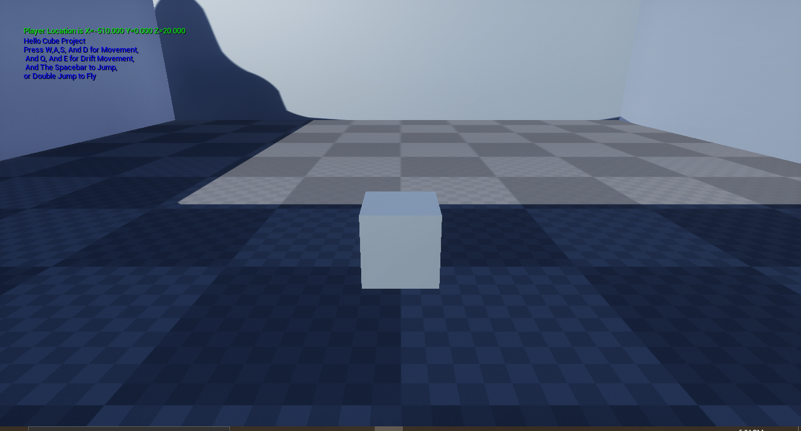

HelloCube - Unreal Engine Project

A simple Unreal Engine 4 project in C++ demonstrating basic cube mechanics and gameplay.

📖 Description

This project features a interactive cube character with basic movement mechanics, built in Unreal Engine 4.
The project serves as a learning exercise and portfolio piece for game programming.

🎮 Features

- Third-person cube pawn
- Basic movement mechanics (forward/backward movement, jump, rotate,drift right/left)
- Simple level design in a room open roof

🛠️ Installation

1. Clone this repository:
git clone https://github.com/A-M22/HelloCubeUnrealEngineProj.git
2. Open the project in Unreal Engine 4.27.2
3. The project should compile and run automatically

📁 Project Structure

HelloCube/
├── Content/          # Unreal Engine assets and maps
├── Source/           # C++ source code
├── Docs/             # media
│   ├── demo.mp4      # Project demonstration video
│   └── screenshot.png # Project screenshot
└── README.md        # This file

🎥 Demo

Check out the demo video: https://youtu.be/s8YfO7XSDSA
or Download it from https://github.com/A-M22/HelloCubeUnrealEngineProj/blob/main/Docs/demo.mp4

🔧 Requirements

- Unreal Engine 4.27.2 or later
- Visual Studio 2022

📝 License

- This project is for portfolio and educational purposes.

👤 Author

-A.M
-GitHub: @A-M22
